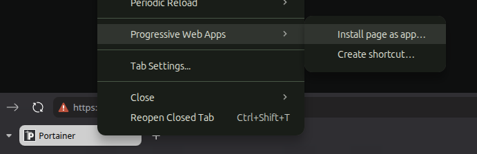

# Vivaldi PWA Manager

A small GTK3 thing for cleaning up after Vivaldi's PWA feature.

Vivaldi can install a website as an app — neat. The `.desktop` file it writes for it is... minimal. No flags for window size. No isolated profile. No dark-mode override. If you ever delete that file you can't easily get it back, even though Vivaldi still remembers the PWA internally. And if you want a real *app-feel* window that's also got tabs and an address bar, well — Vivaldi's UI doesn't have an option for that either.

This is the fix-it utility for all of the above. Lists every Vivaldi-launched `.desktop` in `~/.local/share/applications`, lets you edit them with a sensible form instead of `nano`, surfaces the orphan PWAs Vivaldi forgot about, and adds a third launcher style I'm calling **sandboxed window** — full Vivaldi (tabs, address bar, the lot) but with its own profile and WM class, so the panel treats it as a separate app.

Built and tested on Linux Mint Cinnamon. Should be fine anywhere PyGObject + GTK 3 + a Chromium-based Vivaldi exist.

## What you get

- **List view** of every Vivaldi-launched `.desktop` in `~/.local/share/applications`, with icons. ICE-style `WebApp-*` entries from Mint's Web App Manager show up too, since they're still Vivaldi under the hood.
- **Orphan PWAs**: anything Vivaldi remembers in `~/.config/vivaldi/Default/Web Applications/Manifest Resources/` that doesn't have a launcher yet. One click to make one.
- **Three launcher kinds**, switchable on any existing entry:
  - **PWA** — true Chromium PWA via `--app-id`. No chrome. This is what Vivaldi normally writes.
  - **Web App** — `--app=URL`. No chrome. ICE-style. Quick way to app-ify any URL with no manifest involved.
  - **Sandboxed window** — full Vivaldi window with tabs + address bar + menu, but pinned to its own `--user-data-dir` profile and its own WM class. Looks like a separate app in the taskbar, behaves like a normal browser inside.
- **Structured form** for the Chromium flags people actually want:
  - **Window**: maximized / fullscreen / size / position, `SingleMainWindow`, alt-tab icon override (see below)
  - **Profile & privacy**: isolated profile (one-click), incognito, disable-extensions, `--password-store=basic` (silences keyring prompts on Mint)
  - **Appearance & network**: force dark mode, language override, proxy server
  - **Desktop integration**: Categories, Keywords, MimeType, Comment, NoDisplay
- **Flag reference** — built-in dialog with descriptions for ~25 useful Chromium flags. One-click "insert into Extra flags." Includes the answer to "how do I get the address bar back" (you can't, it's the design — use sandboxed window instead).
- **Doesn't eat your hand-edits**. Unmanaged keys (`X-WebApp-*`, custom additions, weird vendor stuff) round-trip through `RawConfigParser` and survive saves. Vivaldi's `#!/usr/bin/env xdg-open` shebang is preserved when present.

## Requirements

- Python 3.8+
- PyGObject with GTK 3 bindings
- Vivaldi (any modern build)

Mint / Ubuntu / Debian:

```bash
sudo apt install python3-gi gir1.2-gtk-3.0
```

Fedora:

```bash
sudo dnf install python3-gobject gtk3
```

Arch:

```bash
sudo pacman -S python-gobject gtk3
```

## Install

```bash
git clone https://github.com/theJamess/vivaldi-pwa-manager.git
cd vivaldi-pwa-manager
./install_launcher.sh
```

`install_launcher.sh` drops a `.desktop` entry into `~/.local/share/applications` pointing back at this directory. The app shows up in your menu as **Vivaldi PWA Manager**. Move the repo and the launcher breaks — re-run the script if you do.

Or just run it directly:

```bash
python3 vivaldi_pwa_manager.py
```

No build step, no virtualenv, nothing to compile. It's one Python file.

## Using it

- **Left pane**: every Vivaldi launcher it found, plus orphan PWAs at the bottom. Single-click to inspect, double-click (or *Launch*) to open.
- **Right pane**: editor. Change anything, hit *Save*.
- **Kind dropdown**: switching it rewrites the underlying `Exec` line in place, preserving URL/app-id from the form. So you can take an existing chromeless PWA, flip it to *Sandboxed window*, and have a tabbed version pinned alongside.
- **+** in the header bar: opens the *New launcher* dialog. The default is **Install via Vivaldi** — Vivaldi handles real PWAs better than anything we can fake (manifest, extensions, per-app settings), so the manager just opens the URL in Vivaldi and you finish the install from there. Once Vivaldi has the page open, **right-click the tab → Progressive Web Apps → Install page as app…**:

  

  After install, hit Refresh and the new PWA shows up here. The dialog also has direct *Sandboxed window* / *Web App* options for cases where you don't need Vivaldi's PWA registry.
- **ⓘ** in the header bar: the flag reference dialog.
- **Fetch icons…** (download glyph next to the Icon field): scrapes `<link rel=icon>`, `<link rel=apple-touch-icon>`, `<meta property=og:image>`, and any linked web manifest's `icons[]` from a URL you supply. Defaults to the launcher's URL but you can point it elsewhere — e.g. if your Portainer launcher targets `10.0.1.77:9443` (which has no icons of its own), point this at `portainer.io` instead. Self-signed TLS errors are opt-in via a checkbox. Picked icons land in `~/.local/share/vivaldi-pwa-icons/`.
- **Browse system icons** (grid glyph next to the Icon field): searchable browser over every theme name installed under `/usr/share/icons` and `~/.local/share/icons`. Type a query, click a thumbnail, *Use selected* — the Icon field gets set to the theme name (e.g. `web-rumble`, `applications-internet`) so it respects whatever icon theme the user has active later. ~5k icons on a Mint default install; results are capped at 240 per search.
- **Duplicate**: clones the selected launcher to `<stem>-copy.desktop` with `(copy)` appended to Name. Good starting point for "I want a second one of this signed in to a different account."
- **Forget orphan…** (only when an orphan is selected): deletes Vivaldi's cached icon dir for that PWA so it stops showing up in our list. Does *not* fully uninstall the PWA from Vivaldi — use **Open vivaldi://apps** for the proper uninstall path.

After Save, `update-desktop-database` is called so Cinnamon's menu sees the change immediately.

### The three kinds at a glance

| Kind | What it gives you | Use it for |
|------|-------------------|------------|
| **PWA** (`--app-id`) | Chromeless app window. Lives in Vivaldi's PWA registry. | Stuff you actually "installed as an app" via Vivaldi |
| **Web App** (`--app=URL`) | Chromeless app window. No PWA record needed. | Quick app-ifying any URL |
| **Sandboxed window** | Full Vivaldi window. Separate profile. Separate WM class. | Multi-tab dashboards, two-of-the-same logins (two Slacks, two Gmails, take your pick) |

### Fixing the alt-tab icon (the Vivaldi-icon-on-everything problem)

By default, alt-tab and the panel pull the window's icon from `_NET_WM_ICON`, which Chromium sets to its own logo for `--app=URL` and sandboxed windows (true PWAs *should* set this from the manifest, but it's flaky). The `.desktop` file's `Icon=` only gets consulted by some surfaces, and not by Muffin's alt-tab.

Tick **Override alt-tab / taskbar icon via xseticon wrapper** in the *Window* expander. On Save, the manager:

1. Drops a tiny Python helper at `~/.local/bin/vivaldi-pwa-icon-wrap`
2. Rewrites the launcher's `Exec` to: `vivaldi-pwa-icon-wrap <Icon> <WMClass> -- <original Exec>`
3. The helper waits for the new window with that WM class and patches `_NET_WM_ICON` directly via X11

Untick to revert; the manager peels the wrapper back off the next time you Save.

**One dep**: `sudo apt install python3-xlib` (on Fedora: `python3-xlib`; on Arch: `python-xlib`).

**X11 only**. No-op on Wayland — but Cinnamon is X11, so on the target audience this just works. If the helpers are missing at launch time, the wrapper falls through to a plain exec so your launcher never breaks.

### Isolated profile, in one tick

Check **Isolated profile** in the *Profile & Privacy* expander, hit Save. You get:

```
--user-data-dir=$HOME/.local/share/vivaldi-pwa-profiles/<wmclass-slug>
```

Each isolated launcher carves out its own Chromium profile (~50–150 MB), with independent cookies, extensions, bookmarks, the works. Run two of the same web app signed in to different accounts and they'll never see each other.

The profile directory is created on Save, but *only* if it sits inside `~/.local/share/vivaldi-pwa-profiles/`. The tool won't reach into arbitrary user-typed paths and `mkdir -p` them.

## Recipes

### A single "socials" window with 5–6 tabs of your choosing

The shape you want is a *Sandboxed window*: one Vivaldi window with tabs + address bar, isolated profile, own taskbar identity. The wrinkle is making the same 5–6 tabs reopen every time.

Two-step setup:

1. **+ → Sandboxed window** → Name: `Socials`, URL: the first site you'd open (anything — it's just the seed tab). Save. Launch once; you get a single tab.
2. In *that* Vivaldi window, open `vivaldi://settings/startup` → **Startup with → Specific pages** → paste all six URLs. Close, relaunch. The window now opens with all six tabs.

Layer on top:

- **Pin the tabs** (right-click → *Pin Tab*) so they show as favicon-only tabs at the left, can't be accidentally closed, and reopen on launch even without the startup-pages setting.
- **Workspaces inside the window** — Vivaldi's *Workspaces* feature lets you group tabs into named workspaces (e.g. *DMs* / *feeds* / *news*). Right-click a tab → *Move Tab to Workspace*. Switching workspaces filters the tab strip.
- **Per-profile extensions** — install Dark Reader, a content-blocker, Tampermonkey only in this profile. They're isolated and don't touch your main Vivaldi.
- **Distinct alt-tab icon** — tick *Override alt-tab icon* in the Window expander and use **Browse system icons** to pick something like `applications-internet` or whatever fits the vibe.

There's a quicker but quirkier path: instead of step 2, edit the launcher's Exec to include all six URLs as positional args:

```
vivaldi-stable --user-data-dir=… --class=Socials --no-first-run \
  https://x.com https://reddit.com https://news.ycombinator.com \
  https://bsky.app https://threads.net https://mastodon.social
```

This works on cold launch (no existing Socials window), but if the window is *already open* and you click the launcher again, Chromium opens those URLs as *additional* tabs in the existing window — you'll keep accumulating duplicates. The startup-pages approach plays nicely with the singleton.

### Two of the same web app with different logins (two Slacks, two Gmails, …)

1. + → *Sandboxed window* → Name + URL of the app, Save.
2. **Duplicate** the launcher → rename copy to e.g. `Slack (Personal)` and adjust the WM Class so it lands as a separate pinned app.
3. Save the duplicate. Each gets its own isolated profile dir under `~/.local/share/vivaldi-pwa-profiles/`, so cookies/logins don't cross-contaminate.

### Self-hosted lab service that's behind a self-signed cert

The proper fix is to put it behind your reverse proxy with a real cert (Let's Encrypt via SWAG / Caddy / Traefik / …) and access it via that subdomain. PWAs will *just work* — no flags, no cert imports, no shutdown-on-continue when you click through the warning page.

If you have to access raw IP for some reason, add `--ignore-certificate-errors --test-type` to *Extra flags* — but with the gotcha that this only works if Vivaldi *isn't already running* (singleton IPC discards the new launch's flags). Trusting the cert in `vivaldi://certificate-manager` is the only thing that survives the singleton.

## What it writes

- `~/.local/share/applications/*.desktop` — the launchers
- `~/.local/share/vivaldi-pwa-profiles/<slug>/` — isolated profile dirs, only when *Isolated profile* is on
- `~/.local/bin/vivaldi-pwa-icon-wrap` — the icon-override helper, only when *Override alt-tab icon* is on

Nothing else. Vivaldi's profile (`~/.config/vivaldi/`) is read-only as far as this tool is concerned.

## Known limitations

- **True PWAs don't store their URL in the launcher** — Vivaldi keeps it in a Chromium sqlite DB the tool doesn't poke. If you convert a PWA to *Web App* or *Sandboxed window*, you'll need to type the URL.
- **Shell-wrapped Exec lines** (`Exec=sh -c '…'`) are left alone — the form goes read-only for those because nobody wins from this tool second-guessing your shell escaping.
- **Cinnamon-tested only.** Other desktops should work — `.desktop` is a standard — but pinning and WM-class grouping behavior depends on the desktop, not this tool.
- **No, there isn't a flag to put the address bar back into app mode.** I checked. The whole point of `--app` is no chrome. Use *Sandboxed window* if you want chrome.

## Contributing

PRs welcome. Goal is to stay one Python file you can read in 20 minutes. If you're adding a new structured field, the bar is "people will actually flip this regularly" — otherwise it belongs in the flag reference dialog and the *Extra flags* box.

If you find a Vivaldi/Chromium flag that's genuinely useful and not already in the reference dialog, open an issue with what it does and why.

## License

MIT — see [LICENSE](LICENSE). Do whatever you want with it.
